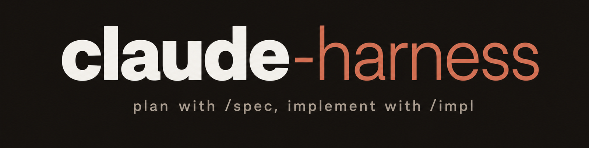

<p align="center"></p>

# claude-harness → moved to [my-llm-kit](https://github.com/badmuriss/my-llm-kit)

This repo is archived. `/spec`, `/impl` and the two subagents (`deep-reasoner`, `fast-worker`) now live in **[badmuriss/my-llm-kit](https://github.com/badmuriss/my-llm-kit)**, alongside the skills, plugins and `AGENTS.md` they were always installed next to. One public surface instead of two.

```bash
git clone https://github.com/badmuriss/my-llm-kit
cd my-llm-kit
./install.sh        # /spec, /impl and the agents into ~/.claude
./setup.sh          # the full cross-agent setup
```

Files: [`commands/spec.md`](https://github.com/badmuriss/my-llm-kit/blob/main/commands/spec.md), [`commands/impl.md`](https://github.com/badmuriss/my-llm-kit/blob/main/commands/impl.md), [`agents/deep-reasoner.md`](https://github.com/badmuriss/my-llm-kit/blob/main/agents/deep-reasoner.md), [`agents/fast-worker.md`](https://github.com/badmuriss/my-llm-kit/blob/main/agents/fast-worker.md).
